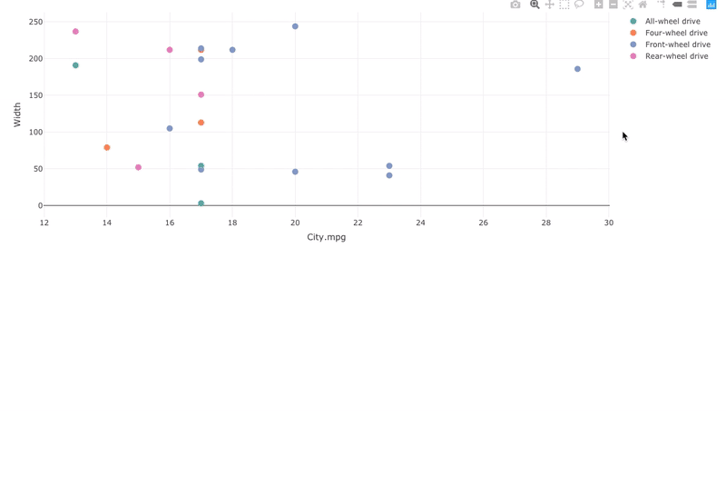

# Interactive plotly <> DT <> image in R/Shiny

- display the image of the hovered marker
- create a table of the selected markers
- display the image of the selected row in the created table

Dependencies: `shiny`, `plotly`, `DT`

